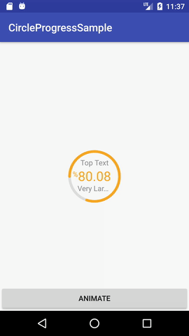
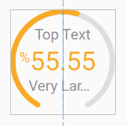
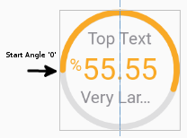
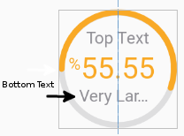

# CircleProgress
Android Custom Circle Progress, with percentage in the middle.

<p align="center">

</p>

<h5>XML Parameters<h5/>

- Change background.
```xml
android:background="#00000000"
```

- Change circle end curve, starts from <i>progressStartAngle</i> to <i>angle</i>
```xml
app:angle="300"
app:progressStartAngle="90"
```
<p align="center">

</p>

- Chnage start angle of progress
```xml
app:progressStartAngle="0"
```
<p align="center">

</p>

- Bottom Text:
```xml
        app:bottomText="@string/large_text"
        app:bottomTextColor="@color/circle_text_color"
        app:bottomTextPaddingTop="10dp"
        app:bottomTextSize="14sp"
        app:bottomTextTruncateAt="30dp" // max width of bottom text, then truncate.
```
<p align="center">

</p>

